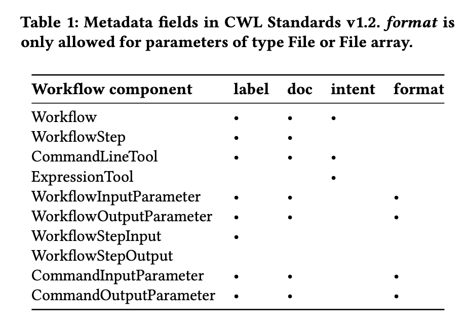

# CWLProv-rdf-examples

## scenario1: propagation of CWL metadata fields (`label`, `doc`, `intent`, `format`)

- Same workflow as https://github.com/RenskeW/runcrate-analysis/tree/main/scenario1
- CWLProv RO stored in `./scenario1/ro`
    - `ro/metadata/provenance`: old RDF
    - `ro/metadata/provenance_new`: example of RDF with extended design, including annotations from CWL metadata fields